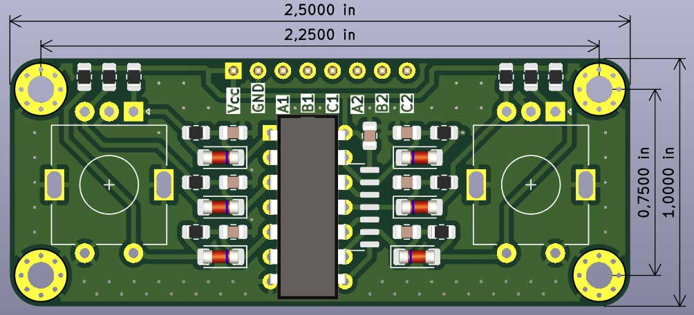
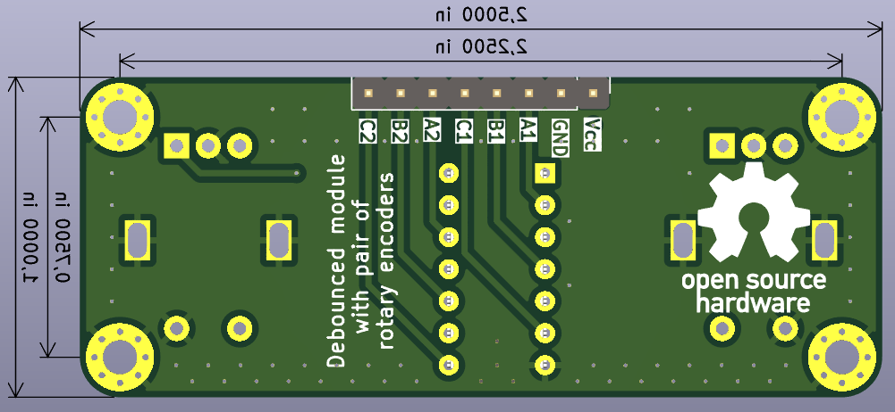

# Module 2 with incremental rotary encoders and hardware bebouncing

 Paired Rotaty Encoder module with debouncing circuitry

## Layout and dimentions

| Top View	| Bottom View |
| ----- | ----- |
|  |  |

- overall dimensions: 1.0 in × 2.5 in
- mounting holes spacing : 0.75 in × 2.25 in
- mounting holes size : M3
- SMD sized:
	- Resistors: 0805
	- Capacitors : 0805
	- Diodes : MiniMELF